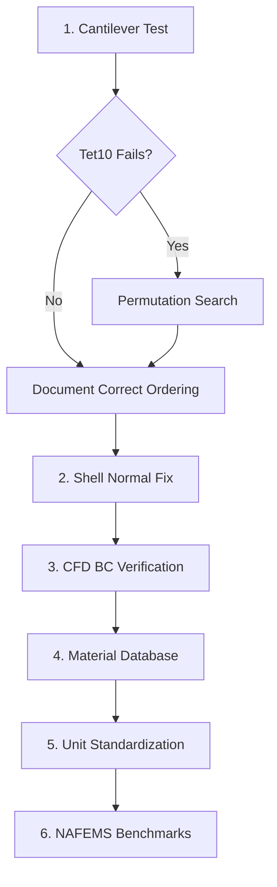

# Physics Accuracy Corrections - Implementation Plan

## Overview
Addressing critical physics implementation errors identified in code review that invalidate simulation results.

> [!CAUTION]
> **Current Status**: Structural results are INVALID due to node ordering mismatch. Thermal BCs are unreliable due to normal computation errors. These must be fixed before any production use.

## Priority 1: Critical Fixes (Immediate)

### 1.1 Tet10 Node Ordering Validation
**Problem**: Current permutation `[0,1,2,3,4,5,6,7,9,8]` between Gmsh and CalculiX is unvalidated and likely incorrect, invalidating ALL structural results.

**Approach**:
1. Create analytical cantilever beam test: δ = FL³/(3EI)
2. Test both Tet4 (correct, for baseline) and Tet10 (suspect)
3. If Tet10 fails, systematically test all 6! permutations of edge nodes [4,5,6,7,8,9]
4. Validate against stress distribution pattern (tensile top, compressive bottom)

**Files to Modify**:
- `core/solvers/calculix_adapter.py:125-130` (thermal)
- `core/solvers/calculix_structural.py:113-118` (structural)
- **[NEW]** `tests/physics/test_tet10_ordering.py`
- **[NEW]** `tests/physics/analytical_cantilever.py`

**Success Criteria**: 
- Tip deflection within 5% of analytical
- Max stress location matches expected (top fiber at fixed end)

---

### 1.2 Shell Element Normal Correction
**Problem**: `sorted(row[1:])` destroys orientation, causing inverted normals for convection/flux BCs.

**Approach**:
1. Remove node sorting in `unique_elems_by_nodes()`
2. Preserve Gmsh face orientation
3. Add explicit `*NORMAL` cards for shell elements
4. Validate against 1D slab analytical solution: q = k·A·ΔT/L

**Files to Modify**:
- `core/solvers/calculix_adapter.py:153-167`
- **[NEW]** `tests/physics/test_shell_normals.py`

**Success Criteria**: 
- Heat flux direction matches expected (hot to cold)
- No `gen3dnor` errors in CalculiX logs

---

### 1.3 CFD Boundary Condition Verification
**Problem**: Wildcard `"(.*)"` may silently apply wrong BC type to unrecognized patches.

**Approach**:
1. Parse `polyMesh/boundary` after `gmshToFoam` to extract actual patch names
2. Error if required patches (`inlet`, `outlet`) are missing
3. Log actual BC applied to each patch
4. Add mass balance check: ∫(ρU·n)dA ≈ 0

**Files to Modify**:
- `core/solvers/cfd_solver.py:242-270`
- `core/solvers/cfd_solver.py` (add `_verify_boundary_conditions()` method)

**Success Criteria**: 
- Simulation fails gracefully if inlet/outlet not found
- Mass imbalance logged and < 1e-6

---

## Priority 2: Medium Priority (Next)

### 2.1 Material Property Database
**Problem**: Hardcoded `k=150 W/mK` is wrong for all aluminum alloys (should be 167-237).

**Approach**:
1. Create `core/materials/` module with NIST data
2. Support: Al 6061-T6, 1100, Pure Al, Steel 1020, Stainless 304, Copper
3. Add temperature dependence: `k(T)`, `cp(T)` via polynomial fits

**Files**:
- **[NEW]** `core/materials/database.py`
- **[NEW]** `core/materials/aluminum.py`
- **[NEW]** `core/materials/steel.py`
- `core/solvers/calculix_adapter.py` (use database)

---

### 2.2 Unit System Standardization
**Problem**: Inconsistent mm vs m scaling across adapters.

**Approach**:
1. Standardize on **SI base units (m, kg, s, K)** internally
2. Convert ONLY at I/O boundaries (templates, reports, GUI)
3. Add `core/units.py` with conversion utilities
4. Document units in all function docstrings

**Files**:
- **[NEW]** `core/units.py`
- `core/solvers/calculix_adapter.py`
- `core/solvers/calculix_structural.py`
- `core/reporting/*.py` (convert for display)

---

### 2.3 NAFEMS Benchmark Suite
**Problem**: Limited validation coverage (only 1D cases).

**Approach**:
Add standard benchmarks:
- **T01**: 2D steady conduction (plate with prescribed edges)
- **T02**: 2D convection
- **LE1**: Thick plate linear elasticity
- **LE10**: Z-section cantilever

**Files**:
- **[NEW]** `core/validation/cases/nafems_t01.py`
- **[NEW]** `core/validation/cases/nafems_t02.py`
- **[NEW]** `core/validation/cases/nafems_le1.py`
- **[NEW]** `core/validation/cases/nafems_le10.py`

---

## Priority 3: Low Priority (Technical Debt)

### 3.1 Replace Custom Surface Extraction
- Use `pyvista.extract_surface()` instead of manual face extraction
- File: `simops_worker.py:346-370`

### 3.2 Convection Coefficient Auto-Calculation
- Add `flow_regime: "natural" | "forced_air" | "liquid"`
- Calculate `h` from Nusselt correlations
- File: `core/physics/convection.py` (new)

### 3.3 Radiation Model
- Add `*RADIATE` for high-temp cases (T > 400K)
- File: `core/solvers/calculix_adapter.py`

---

## Implementation Sequence



**Estimated Timeline**:
- **Week 1**: Critical fixes (1.1, 1.2, 1.3)
- **Week 2**: Medium priority (2.1, 2.2, 2.3)
- **Week 3**: Low priority + documentation

---

## Verification Plan

### Automated Tests
```bash
# Run after each fix
pytest tests/physics/test_tet10_ordering.py -v
pytest tests/physics/test_shell_normals.py -v
pytest tests/physics/test_cfd_boundaries.py -v
pytest core/validation/ -v  # All benchmarks
```

### Manual Verification
1. **Structural**: Load `tests/physics/cantilever_beam.step` → Check deflection matches δ = FL³/(3EI)
2. **Thermal**: Load `tests/physics/slab_convection.step` → Check heat flux q = k·A·ΔT/L  
3. **CFD**: Load `tests/physics/cylinder_re40.step` → Check Cd ≈ 1.52

---

## Risk Mitigation

> [!WARNING]
> **Breaking Change**: Fixing Tet10 ordering will change ALL historical structural results. Archive existing outputs before deployment.

**Mitigation**:
1. Create `core/solvers/calculix_adapter_legacy.py` (backup)
2. Add feature flag: `USE_LEGACY_TET10 = False` (default: new ordering)
3. Document migration in `CHANGELOG.md`
4. Re-run all validation cases and update expected results
